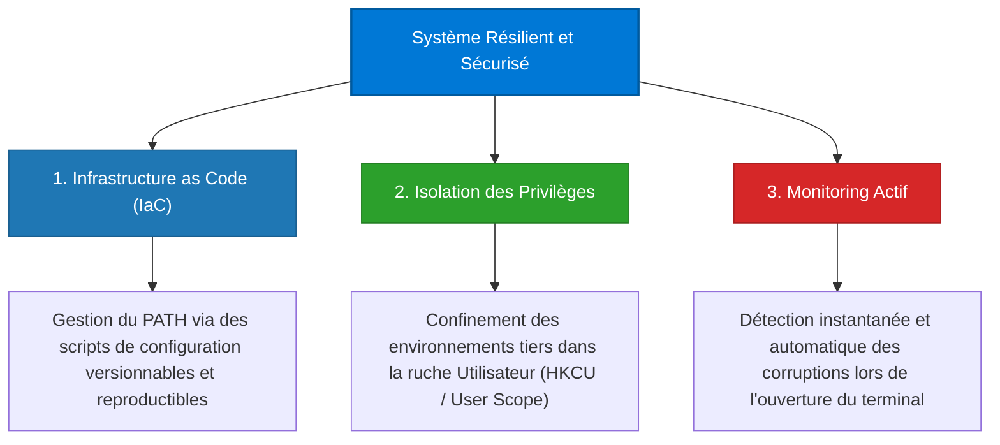

# WinPath Recovery Toolkit

[](https://www.microsoft.com/windows)
[](https://learn.microsoft.com/powershell/)
[](./license)

**WinPath Recovery Toolkit** est une suite d'ingénierie système dédiée au diagnostic, à la restauration déterministe et à la sécurisation proactive de la variable d'environnement globale `PATH` sous le système d'exploitation Windows. 

Conçu selon des standards académiques et professionnels, ce projet formalise une méthodologie d'intervention en environnement dégradé et fournit des scripts PowerShell robustes pour pallier les corruptions de registre induites par les installeurs tiers.

---

## Table des matières

1. [Introduction & Problématique](#1-introduction--problématique)
2. [Architecture du Routage PATH sous Windows](#2-architecture-du-routage-path-sous-windows)
    - 2.1 [Hiérarchie des Ruches de Registre (HKLM vs HKCU)](#21-hiérarchie-des-ruches-de-registre-hklm-vs-hkcu)
    - 2.2 [Mécanisme de Construction de la Variable Finale](#22-mécanisme-de-construction-de-la-variable-finale)
    - 2.3 [Vecteurs Communs de Défaillance](#23-vecteurs-communs-de-défaillance)
3. [Diagnostic d'Incident en Mode Dégradé (Hors-PATH)](#3-diagnostic-dincident-en-mode-dégradé-hors-path)
    - 3.1 [Symptomatologie et Paradoxe Diagnostique](#31-symptomatologie-et-paradoxe-diagnostique)
    - 3.2 [Méthodologie d'Audit In-Memory](#32-méthodologie-daudit-in-memory)
4. [Protocole de Restauration Curatif](#4-protocole-de-restauration-curatif)
    - 4.1 [Spécifications du Script Restore-SystemPath.ps1](#41-spécifications-du-script-restore-systempathps1)
    - 4.2 [Guide d'Exécution et Paramètres](#42-guide-dexécution-et-paramètres)
5. [Mesures Préventives & Monitoring Passif](#5-mesures-préventives--monitoring-passif)
    - 5.1 [Déploiement du Watchdog via Install-PathMonitor.ps1](#51-déploiement-du-watchdog-via-install-pathmonitorps1)
    - 5.2 [Principe de Moindre Privilège par Isolation des Ruches](#52-principe-de-moindre-privilège-par-isolation-des-ruches)
6. [Synthèse : Les 3 Piliers de la Résilience](#6-synthèse--les-3-piliers-de-la-résilience)
7. [Structure du Toolkit & Indexation des Fichiers](#7-structure-du-toolkit--indexation-des-fichiers)
8. [Crédits et Références](#8-crédits-et-références)

---

## 1. Introduction & Problématique

Dans les systèmes d'exploitation modernes, la variable d'environnement `PATH` fait office de système de routage logique en permettant à l'interpréteur de commandes (cmd, PowerShell, etc.) de localiser et d'exécuter les utilitaires binaires par leur nom court sans exiger la spécification de leur chemin d'accès absolu. 

Une rupture ou une altération accidentelle de cette variable engendre instantanément une paralysie opérationnelle majeure. L'utilisateur se retrouve dans l'incapacité d'exécuter les commandes de diagnostic et de gestion réseau de base telles que `ipconfig`, `ping`, `reg`, ou `nslookup`. Ce toolkit apporte une réponse systématique et industrialisée à ces situations de crise, en rétablissant les fonctionnalités d'origine de l'OS tout en appliquant les principes de la sécurité par conception.

---

## 2. Architecture du Routage PATH sous Windows

### 2.1 Hiérarchie des Ruches de Registre (HKLM vs HKCU)

Contrairement aux systèmes de type UNIX qui s'appuient sur des fichiers de configuration à plat (ex : `.bashrc`, `.profile`), Windows stocke ses variables d'environnement de façon structurée au sein de la base de registre. Deux scopes distincts coexistent :

| Attribut | Ruche Machine (HKLM) | Ruche Utilisateur (HKCU) |
| :--- | :--- | :--- |
| **Chemin du Registre** | `HKLM\System\CurrentControlSet\Control\Session Manager\Environment` | `HKCU\Environment` |
| **Portée d'Application** | Globale (S'applique à tout l'OS et à l'ensemble des comptes utilisateurs) | Locale (Restreinte à la session de l'utilisateur actif) |
| **Privilèges Requis** | Administrateur (`runas` / Élévation de privilèges) | Utilisateur Standard |
| **Contenu Standard** | Répertoires critiques de l'OS (`System32`, `Wbem`, `PowerShell`, `OpenSSH`) | Raccourcis vers les outils de développement locaux (`npm`, `Python`, `VS Code`) |

### 2.2 Mécanisme de Construction de la Variable Finale

Lors du démarrage d'une session ou du lancement d'un nouveau processus, Windows fusionne dynamiquement les valeurs des deux ruches pour construire le `PATH` en mémoire vive selon une règle de concaténation stricte :

$$\text{PATH Final} = \text{PATH Machine (HKLM)} + \text{PATH Utilisateur (HKCU)}$$

Les chemins issus de la ruche machine (HKLM) sont résolus en premier, garantissant la priorité des utilitaires système sur les logiciels utilisateur tiers.

### 2.3 Vecteurs Communs de Défaillance

La corruption du `PATH` provient généralement de deux facteurs :
1. **L'affectation destructive (Méthode SET au lieu d'APPEND)** : Certains programmes d'installation tiers, lorsqu'ils sont exécutés avec des privilèges administrateur, effectuent une écriture écrasante (`SET PATH=C:\Program Files\MonLogiciel`) au lieu d'une concaténation (`APPEND`). La ruche `HKLM` perd alors instantanément la trace des chemins d'accès système essentiels.
2. **La troncature silencieuse (Limite des 2047 caractères)** : La variable d'environnement globale au niveau du système (`HKLM`) est assujettie à une limite historique de **2047 caractères**. Si une suite de logiciels longs pousse la longueur de la chaîne au-delà de cette borne, l'OS ampute de manière invisible tout ce qui dépasse, coupant ainsi l'accès aux répertoires restants.

---

## 3. Diagnostic d'Incident en Mode Dégradé (Hors-PATH)

### 3.1 Symptomatologie et Paradoxe Diagnostique

Le symptôme caractéristique est le retour systématique de l'erreur suivante lors de la saisie d'outils de base :

> *« Le terme 'ipconfig' n'est pas reconnu comme nom d'applet de commande, fonction, fichier de script ou programme exécutable. »*

Cependant, un **paradoxe diagnostique** se manifeste fréquemment : les applications tierces récemment installées (comme Git ou Node.js) continuent de s'exécuter normalement. Cela démontre que les binaires système (situés dans `C:\Windows\System32`) ne sont pas corrompus ou absents du disque, mais que le routage système via la clé de registre machine a été rompu au profit exclusif des applications tierces.

### 3.2 Méthodologie d'Audit In-Memory

Puisque les utilitaires système externes ne peuvent plus être résolus par l'interpréteur, le diagnostic doit s'effectuer en s'appuyant uniquement sur des fonctionnalités intégrées en mémoire vive, telles que les cmdlets PowerShell natives ou les appels directs aux classes du Framework .NET. Ces méthodes fonctionnent de manière totalement autonome et indépendante du `PATH`.

* **Étape 1 : Inspection de la session active en mémoire**
  ```powershell
  $env:PATH -split ';'
  ```
  *Analyse du résultat :* Si les chemins vitaux de Windows (`C:\Windows\system32`) sont absents mais que les environnements tiers apparaissent, le routage à chaud est altéré.

* **Étape 2 : Interrogation directe de la ruche du Registre Machine**
  ```powershell
  (Get-ItemProperty -Path 'HKLM:\System\CurrentControlSet\Control\Session Manager\Environment').PATH -split ';'
  ```
  *Analyse du résultat :* Si le retour de cette commande confirme l'absence des chemins de base du système d'exploitation, l'écrasement de la variable globale globale est avéré.

---

## 4. Protocole de Restauration Curatif

### 4.1 Spécifications du Script [Restore-SystemPath.ps1](./2%20-%20Scripts/Restore-SystemPath.ps1)

Pour restaurer l'intégrité de la ruche `HKLM` de façon déterministe et automatisée, le toolkit propose le script curatif [`Restore-SystemPath.ps1`](./2%20-%20Scripts/Restore-SystemPath.ps1). Il applique les mesures de sécurité suivantes :

1. **Sauvegarde préventive à chaud** : Avant toute modification du registre, la variable globale actuelle est extraite et sauvegardée dans un fichier horodaté sur le Bureau de l'utilisateur (nommé sous le format `PATH_Backup_AAAAMMJJ_HHMM.txt`).
2. **Priorisation stricte des répertoires OS** : Le script injecte inconditionnellement les cinq chemins fondamentaux de Windows en tête de chaîne :
   - `C:\Windows\system32`
   - `C:\Windows`
   - `C:\Windows\System32\Wbem`
   - `C:\Windows\System32\WindowsPowerShell\v1.0`
   - `C:\Windows\System32\OpenSSH`
3. **Validation physique des chemins tiers** : Pour éviter l'accumulation de chemins obsolètes et alléger le registre, chaque répertoire additionnel spécifié est testé sur le disque (`Test-Path`). S'il est absent, il est exclu du nouveau `PATH` avec l'émission d'un avertissement (`[WARN]`).
4. **Écriture atomique sécurisée** : Les modifications sont appliquées via les classes .NET natives (`[Environment]::SetEnvironmentVariable`) afin de s'assurer d'une mise à jour robuste et instantanée du registre sans dépendances externes.

### 4.2 Guide d'Exécution et Paramètres

Le script exige des privilèges administratifs élevés et bloque son exécution si cette condition n'est pas remplie (`#Requires -RunAsAdministrator`).

```powershell
# 1. Lancer une instance de PowerShell avec droits Administrateur ("Exécuter en tant qu'administrateur")

# 2. Lever temporairement la restriction d'exécution pour le processus en cours
Set-ExecutionPolicy -Scope Process -ExecutionPolicy Bypass

# 3. Option A : Rétablissement standard avec chemins tiers par défaut
# Rétablit l'OS et intègre par défaut : Node.js, dotnet, Git, et PuTTY s'ils existent physiquement.
& ".\2 - Scripts\Restore-SystemPath.ps1"

# 4. Option B : Rétablissement personnalisé
# Permet de définir explicitement la liste des applications tierces autorisées dans HKLM.
& ".\2 - Scripts\Restore-SystemPath.ps1" -CustomPaths "C:\Program Files\nodejs\", "C:\Program Files\Git\cmd", "C:\MonLogiciel\bin"
```

---

## 5. Mesures Préventives & Monitoring Passif

### 5.1 Déploiement du Watchdog via [Install-PathMonitor.ps1](./2%20-%20Scripts/Install-PathMonitor.ps1)

Afin d'éviter qu'une corruption logicielle future ne passe inaperçue, le script [`Install-PathMonitor.ps1`](./2%20-%20Scripts/Install-PathMonitor.ps1) installe un monitoring passif de sécurité (Watchdog) dans l'environnement de l'utilisateur.

Le script injecte un bloc de code au sein du profil personnel PowerShell (`$PROFILE`). À chaque ouverture d'un terminal, le profil exécute automatiquement cette fonction d'auto-diagnostic :

```powershell
# --- MONITORING D'INTEGRITE DU PATH ---
$SysPathCheck = [Environment]::GetEnvironmentVariable("Path", [EnvironmentVariableTarget]::Machine)
if ($SysPathCheck -notmatch "(?i)C:\\Windows\\system32") {
    Write-Host "[ALERTE] Le PATH Systeme a ete altere. Chemins vitaux manquants." -ForegroundColor White -BackgroundColor DarkRed
}
# --------------------------------------
```

* **Protection contre le sur-provisionnement** : Le script intègre un algorithme d'analyse textuelle empêchant toute duplication. Si le bloc de monitoring est détecté dans le fichier `$PROFILE`, l'injection est ignorée.
* **Signal d'alerte visuel** : En cas de détection d'une corruption de la ruche Machine, une alerte blanche sur fond rouge vif apparaît en haut de la console pour avertir immédiatement l'opérateur.

### 5.2 Principe de Moindre Privilège par Isolation des Ruches

La solution ultime de sécurisation réside dans l'application stricte du principe d'isolation des environnements d'exécution :

1. **Règle du Moindre Privilège ("User Scope")** : Sauf contrainte technique majeure, les environnements de développement et outils logiciels tiers (comme Python, Node.js, Git, VS Code) doivent être installés exclusivement pour le périmètre utilisateur (`Utilisateur Actuel`). De ce fait, les modifications du `PATH` s'effectuent au sein de la ruche `HKCU` et ne nécessitent aucune élévation de privilèges. Ainsi, l'intégrité de la variable globale `HKLM` (Système) est préservée de toute altération accidentelle.
2. **Isolation des variables et profils** : Le fichier `$PROFILE` doit être cantonné au paramétrage interne de sa session (chargement de modules locaux, gestion des prompts) et non à la résolution de conflits de chemins d'accès globaux. La gestion fine des environnements d'exécution par défaut (comme le choix entre PowerShell 5.1 natif et PowerShell Core 7+) doit être déportée dans l'interface de gestion de **Windows Terminal**.

---

## 6. Synthèse : Les 3 Piliers de la Résilience

L'application des concepts de ce toolkit structure la résilience de l'espace de travail Windows autour de trois axes fondamentaux :



---

## 7. Structure du Toolkit & Indexation des Fichiers

L'arborescence ci-dessous détaille l'organisation des ressources. Les liens pointent directement vers les documents et codes sources du projet :

* [**`1 - Docs/`**](./1%20-%20Docs/) : Documentation théorique et synthétique.
  * [**`Path_Issue_Rapport.pdf`**](./1%20-%20Docs/Path_Issue_Rapport.pdf) : Rapport d'analyse technique complet (Livre Blanc).
  * [**`Rapport_slides.pdf`**](./1%20-%20Docs/Rapport_slides.pdf) : Support visuel de présentation (Slides).
* [**`2 - Scripts/`**](./2%20-%20Scripts/) : Outils automatisés d'administration système.
  * [**`Restore-SystemPath.ps1`**](./2%20-%20Scripts/Restore-SystemPath.ps1) : Script d'alignement et de restauration curative du registre (`HKLM`).
  * [**`Install-PathMonitor.ps1`**](./2%20-%20Scripts/Install-PathMonitor.ps1) : Script d'installation préventive du garde-fou dans le profil utilisateur.
* [**`license`**](./license) : Licence d'exploitation open source MIT.
* [**`README.md`**](./README.md) : Présente charte et manuel utilisateur (ce document).

---

## 8. Crédits et Références

* **Auteur** : Nelson Bandos (Administrateur Réseau & Système)
* **LinkedIn** : [Nelson Bandos](https://www.linkedin.com/in/nelson-bandos)
* **Portfolio** : [nelson-bandos.vercel.app](https://nelson-bandos.vercel.app)
* **Date de l'incident et de la résoultion** : 5 juillet 2026